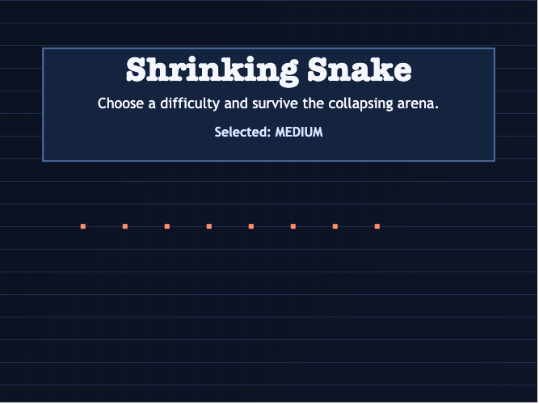
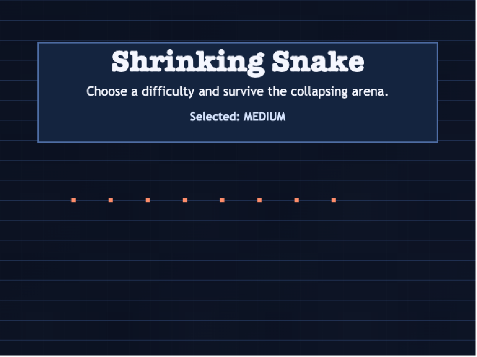
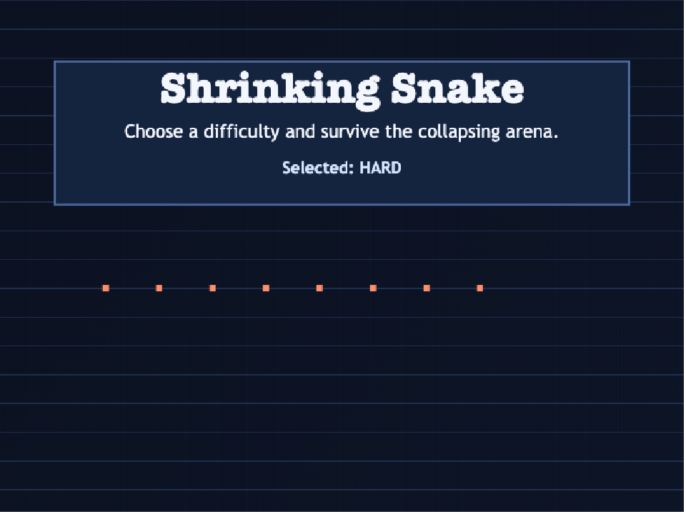
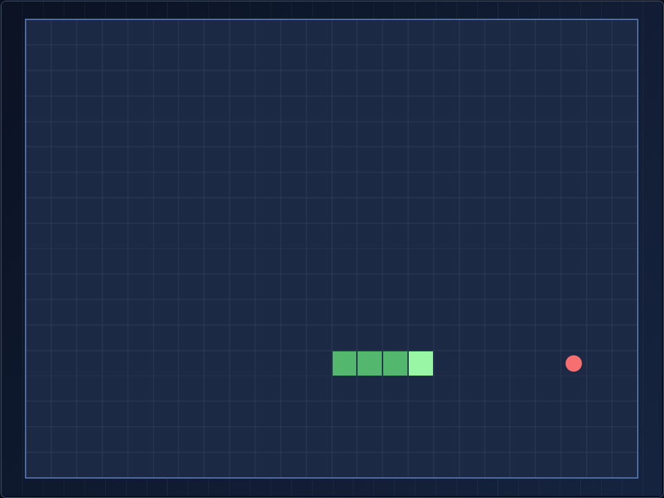
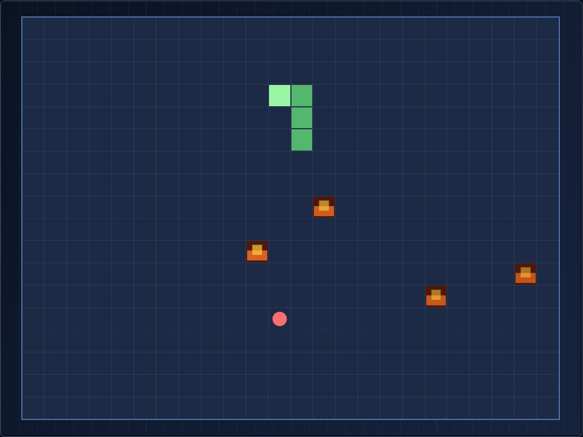
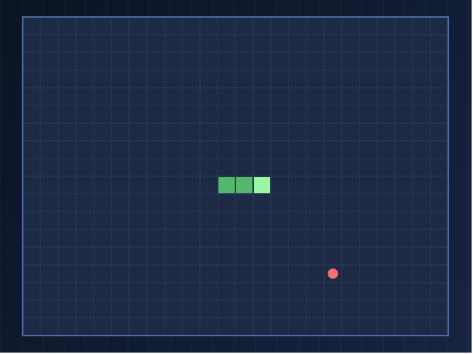
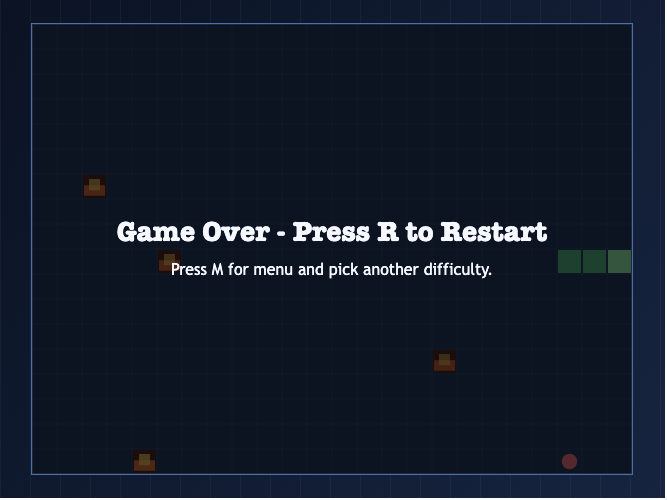

# Build Classic Small Game - Manual Run 2

<p align="center">
  <strong>Shrinking Snake</strong><br/>
  A retro-style browser arcade game with difficulty modes, collapsing arena pressure, pixel-fire hazards, survival scoring, and procedural 8-bit music.
</p>

<p align="center">
  
</p>

## GIF Captures
### Menu Animation (8-bit hero snake)
<p align="center">
  
</p>

### Difficulty Selection Flow
<p align="center">
  
</p>

### Easy Mode Mid-Game
<p align="center">
  
</p>

### Hard Mode Mid-Game
<p align="center">
  
</p>

## What This Repo Contains
- A standalone Vite + TypeScript browser game:
  - `games/2026-02-06-shrinking-snake`
- Deterministic game logic + unit tests
- Difficulty system (`Easy`, `Medium`, `Hard`)
- Local leaderboard persistence
- Procedural chiptune audio (menu + gameplay + game-over sting)

## Gameplay At A Glance
<p align="center">
  
  
</p>

### Core Loop
1. Pick a difficulty from the menu.
2. Collect food to grow and increase score.
3. Survive shrinking bounds (where applicable) and avoid collisions.
4. In Hard mode, avoid pixel-fire hazard tiles.
5. Push your survival score and beat your local top-10.

## Difficulty Rules
- **Easy**
  - Tick speed: `130ms`
  - No arena shrink
  - Food stays at least 2 tiles away from active walls when possible
  - No fire hazards
- **Medium**
  - Tick speed: `110ms`
  - Arena shrinks every `25` progression points
  - Food stays at least 1 tile away from active walls when possible
  - No fire hazards
- **Hard**
  - Tick speed: `90ms`
  - Arena shrinks every `15` progression points
  - Food can spawn on wall-adjacent tiles
  - Pixel-fire hazards enabled and refreshed on food pickup

## Controls
### Menu
- Select difficulty: `1 / 2 / 3`
- Or cycle with arrow keys and press `Enter`

### In Game
- Move: `Arrow Keys` or `WASD`
- Pause/Resume: `P`
- Restart run: `R`
- Back to menu: `M`
- Fullscreen: `F`

## Scoring
Score updates in real time from:

`score = round((elapsedSeconds * 100 + foodsEaten * 50) * difficultyMultiplier)`

Difficulty multipliers:
- Easy: `1.0`
- Medium: `1.25`
- Hard: `1.5`

## Local Persistence
Leaderboard is stored in browser local storage under:
- `shrinking-snake-v1-leaderboard`

Stored fields per entry:
- `score`
- `elapsedSeconds`
- `foodsEaten`
- `difficulty`
- `date`
- `seed`

## Run Locally
```bash
cd games/2026-02-06-shrinking-snake
npm install
npm run dev
```
Open the printed local URL (typically `http://localhost:5173`).

## Test and Build
```bash
cd games/2026-02-06-shrinking-snake
npm test -- --run
npm run build
```

## Project Layout
```text
games/2026-02-06-shrinking-snake/
  src/
    main.ts          # runtime, input, state orchestration
    render.ts        # canvas drawing (menu + board)
    logic.ts         # deterministic game engine
    audio.ts         # procedural music/sfx controller
    storage.ts       # local leaderboard persistence
    scoring.ts       # score formula
    *.test.ts        # unit tests
```

## Notes
- Music requires user interaction before browsers allow playback.
- Leaderboard is local-only by design (no backend).
